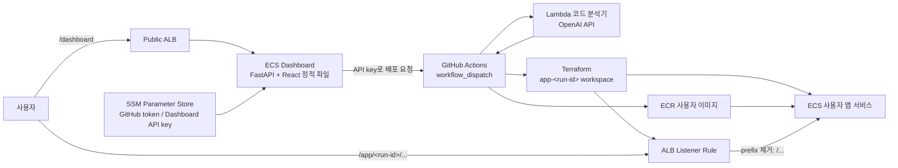
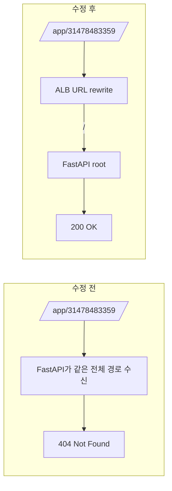
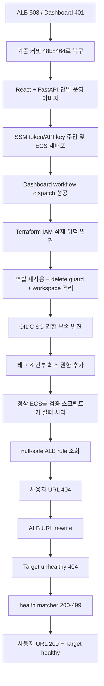

# Deplight 배포 플랫폼 복구·정비 보고서

작성일: 2026-08-11  
대상: `deplight-app`, `deplight-platform-v3`, 루트 GitHub Actions 및 AWS 운영 환경

## 1. 요약

이번 정비의 목적은 단순히 GitHub Actions를 초록색으로 만드는 것이 아니라, 사용자가 저장소와 브랜치를 입력하면 실제 애플리케이션이 격리된 ECS 서비스로 배포되고 ALB URL로 접근 가능한 상태까지 복구하는 것이었다.

가장 큰 문제는 다음 핵심 축에 있었다.

| 중요도 | 문제 | 실제 영향 | 결과 |
|---|---|---|---|
| Critical | Terraform 실행이 공용 IAM 역할을 삭제하려 함 | Dashboard와 모든 사용자 앱 배포가 동시에 중단될 수 있음 | 기존 역할 재사용, target 정비, delete guard 추가 |
| Critical | 사용자 앱 ALB 경로가 컨테이너에 그대로 전달됨 | ECS가 실행 중이어도 사용자 URL은 404 | ALB URL rewrite 도입, 실제 URL 200 확인 |
| High | Dashboard의 GitHub token 주입/갱신 불일치 | 배포 요청이 `401 Bad credentials`로 실패 | SSM secret 주입 및 ECS 재배포로 복구 |
| High | 프런트엔드와 FastAPI 실행 구조 불일치 | 로컬 포트 충돌, ECS 503, 운영 실행 방식 혼란 | React를 빌드해 FastAPI가 함께 제공하는 단일 컨테이너로 통합 |
| High | AI가 추정한 health path가 실제 앱과 다름 | 정상 앱이 Target Group에서 unhealthy | 범용 liveness matcher로 변경, target healthy 확인 |
| Medium | GitHub Actions 검증 스크립트 자체 오류 | 정상 인프라가 실패로 판정됨 | null-safe ALB rule 조회로 수정 |

최종 확인된 상태:

- Dashboard와 사용자 앱은 동일 ALB 뒤에서 서로 다른 경로로 서비스된다.
- 테스트 앱 URL `http://delightful-deploy-alb-1528624322.ap-northeast-2.elb.amazonaws.com/app/31478483359/`은 `200 OK`를 반환한다.
- 테스트 앱 Target Group은 `healthy`다.
- Terraform 적용 결과는 URL rewrite와 health matcher 각각 `0 added, 1 changed, 0 destroyed`였다.
- 애플리케이션 복구 기준 커밋은 `8672d32`이며, 이후 운영 검증과 IAM 재현성 보강을 별도 커밋으로 추가했다.

## 2. 현재 배포 구조



운영에서는 `npm` 개발 서버와 FastAPI를 따로 실행하지 않는다. React는 이미지 빌드 단계에서 정적 파일로 만들어지고, FastAPI 프로세스 하나가 API와 UI를 함께 제공한다. `npm run dev`와 `uvicorn`을 각각 실행하는 방식은 로컬 개발에만 해당한다.

## 3. 문제별 복구 내용

### 3.1 Dashboard 실행 구조 통합

#### 왜 문제가 됐나

`deplight-app` 프런트엔드와 `deplight-platform-v3` FastAPI를 별개 서비스처럼 다루면서 운영 포트와 실행 주체가 불명확했다. 같은 포트 3000을 두 프로세스가 사용하면 `address already in use`가 발생했고, ECS에서는 실제 요청을 받을 프로세스와 ALB 설정이 어긋나 503으로 이어질 수 있었다.

#### 무엇을 바꿨나

- React UI와 FastAPI API를 하나의 운영 이미지로 통합했다.
- Docker multi-stage build에서 프런트엔드를 빌드하고 결과물을 FastAPI 이미지에 포함했다.
- FastAPI가 React 정적 파일과 SPA fallback을 제공하도록 했다.
- UI의 API 호출 경로를 같은 origin 기준으로 정리했다.
- UI 로그인 화면은 요구사항에 따라 제거했지만, 배포 쓰기 API는 `DASHBOARD_API_KEY`로 보호한다.

#### 어떻게 검증했나

- Dashboard ECS task가 정상 기동하고 ALB 뒤에서 응답하는 것을 확인했다.
- 운영 컨테이너는 FastAPI 한 프로세스만 실행하므로 npm 개발 서버와 포트 경쟁이 발생하지 않는다.
- 관련 커밋: `72386f1`, `8b32dc3`, `7ba817d`

### 3.2 GitHub 배포 트리거와 token 401 복구

#### 왜 문제가 됐나

GitHub classic PAT 자체는 유효했지만, Dashboard ECS task가 최신 SSM 값을 사용하지 않거나 배포 설정이 갱신되지 않은 상태에서는 GitHub REST API가 `401 Bad credentials`를 반환했다. GitHub Actions가 성공한 적이 있다는 사실은 Dashboard 컨테이너가 현재 올바른 token을 사용한다는 보장이 아니었다.

#### 무엇을 바꿨나

- SSM의 `/delightful/github/token`을 `GITHUB_TOKEN`으로 Dashboard task에 주입했다.
- `/delightful-deploy/dashboard-api-key`를 `DASHBOARD_API_KEY`로 주입했다.
- Dashboard가 배포할 저장소를 `sangmu1126/Deplight`로 정렬했다.
- Dashboard ECS 서비스를 강제 재배포해 새 secret 값을 읽도록 했다.
- 실패 경로에서도 원래 Dashboard deployment ID가 보존되도록 fallback을 수정했다.

#### 어떻게 검증했나

- PAT로 GitHub `/user`와 workflow 조회가 성공하는 것을 확인했다.
- Dashboard API를 통한 실제 workflow dispatch가 성공했다.
- 배포 ID `36c08148-847b-4ca9-a0e4-6cc0738b4882`가 GitHub run `31476914389`를 생성했다.
- 관련 커밋: `7a9cf79`, `81e3fb4`

### 3.3 Terraform state 격리와 공용 IAM 역할 파괴 방지

#### 왜 문제가 됐나

사용자 앱용 targeted apply에서 `use_existing_roles` 값과 target 범위가 어긋나 Terraform이 공용 ECS execution/task 역할을 `count index out of range`로 삭제하려 했다. 실제 실행 로그에서 역할과 inline policy가 삭제됐고, Dashboard 서비스 갱신이 오래 대기하는 상황이 발생했다.

이는 사용자 앱 하나의 배포가 플랫폼 전체 권한을 제거할 수 있는 가장 위험한 문제였다.

#### 무엇을 바꿨나

- v3 Terraform state를 S3 backend로 통일했다.
- 사용자 앱마다 `app-<github-run-id>` workspace를 사용하도록 했다.
- 사용자 앱 배포에서는 기존 공용 IAM 역할을 명시적으로 재사용한다.
- Dashboard/플랫폼 배포 target에 필요한 IAM 역할과 정책을 포함했다.
- apply 전에 delete-only action이 하나라도 있으면 중단하는 guard를 추가했다.
- 사용자 앱 Security Group과 공용 플랫폼 네트워크 리소스의 소유 범위를 분리했다.

#### 어떻게 검증했나

- 사용자 앱 Terraform plan에서 공용 IAM 역할 삭제가 사라졌다.
- URL rewrite와 health matcher 적용 시 모두 삭제 0, 교체 0을 확인했다.
- 기존 원격 S3 state 초기화 시 로컬 state로 덮어쓰지 않도록 명시적으로 `no`를 선택했다.
- 관련 커밋: `546dca6`, `e4190a1`, `05524b1`

### 3.4 GitHub OIDC 역할의 최소 SG 권한 보완

#### 왜 문제가 됐나

Terraform이 사용자 앱 Security Group을 만들 수는 있었지만 생성 시 태그 추가와 기본 egress 수정 권한이 없어 순차적으로 실패했다.

- 1차 실패: `ec2:CreateTags`
- 2차 실패: `ec2:RevokeSecurityGroupEgress`

#### 무엇을 바꿨나

실환경 `github-actions-deplight-role`의 inline policy `TerraformV3BootstrapAccess`에 다음 권한을 제한적으로 추가했다.

- 생성 시점에만 `ec2:CreateTags`
- 사용자 앱 SG 규칙 관리:
  - `AuthorizeSecurityGroupIngress/Egress`
  - `RevokeSecurityGroupIngress/Egress`
  - `DeleteSecurityGroup`

권한 대상은 다음 두 resource tag 조건을 모두 만족하는 SG로 제한했다.

- `ManagedBy = Terraform`
- `AppName = user-app-*`

#### 어떻게 검증했나

- 재실행에서 Terraform Plan과 Apply가 모두 통과했다.
- 생성된 SG와 workspace state를 보존해 Terraform 소유권을 유지했다.

이 정책은 `infrastructure/iam/terraform-v3-bootstrap-access.json`에 source of truth로 저장하고, 관리자용 `scripts/bootstrap_aws.sh`가 `TerraformV3BootstrapAccess` inline policy로 반복 적용할 수 있게 연결했다.

### 3.5 정상 인프라를 실패로 판정하던 Actions 검증 수정

#### 왜 문제가 됐나

ECS 서비스가 `desired=1`, `running=1`이어도 ALB 기본 listener rule은 `Conditions`가 비어 있다. 기존 AWS CLI JMESPath가 이 null 값을 `join()`에 전달해 검증 단계가 exit code 255로 실패했다.

#### 무엇을 바꿨나

- ALB rule 조회를 `jq` 기반으로 변경했다.
- `.Conditions[]?`와 `.Values[]?` optional iterator를 사용해 기본 rule을 안전하게 건너뛴다.
- 정확한 `/app/<run-id>/*` rule만 선택한다.

#### 어떻게 검증했나

- 수정 후 `Verify AWS deployment (ECS/ALB)` 단계가 통과했다.
- ECS task image, listener rule, Target Group, 로그 그룹 조회가 모두 완료됐다.
- 관련 커밋: `b7bfe5b`

### 3.6 사용자 앱 URL 404 해결

#### 왜 문제가 됐나

ALB는 `/app/<run-id>/*`로 앱을 구분했지만 요청 경로를 그대로 FastAPI에 전달했다. 사용자 앱이 `/`만 정의한 경우 외부 `/app/<run-id>/` 요청을 컨테이너가 알 수 없어 404를 반환했다.



#### 무엇을 바꿨나

- AWS Provider를 URL rewrite를 지원하는 `6.19.0`으로 정확히 고정했다.
- Listener Rule에 다음 변환을 추가했다.

```text
^/app/<run-id>/?(.*)$  ->  /$1
```

#### 어떻게 검증했나

- 실제 plan: listener rule 한 개만 in-place update, 삭제/교체 없음.
- AWS `describe-rules`에서 `url-rewrite` transform 등록을 확인했다.
- 외부 사용자 URL이 기존 404에서 `200 OK`로 변경됐다.
- 관련 커밋: `adc9186`

### 3.7 정상 앱이 unhealthy가 되던 health check 수정

#### 왜 문제가 됐나

AI 분석기가 테스트 앱의 health path를 `/health`로 추정했지만 앱은 `/`만 제공했다. 애플리케이션은 정상 실행 중이었으나 Target Group은 `/health`의 404를 보고 `Target.ResponseCodeMismatch`로 판정했다.

#### 무엇을 바꿨나

임의의 사용자 애플리케이션을 받는 PaaS 특성상 특정 route의 존재보다 프로세스가 HTTP에 응답하는지가 liveness에 더 중요하다. 따라서 matcher를 다음과 같이 변경했다.

```text
200-399 -> 200-499
```

- 2xx~4xx: 앱 프로세스가 응답 가능하므로 alive
- 5xx/timeout/connection failure: unhealthy

#### 어떻게 검증했나

- plan: Target Group 한 개만 in-place update, 삭제/교체 없음.
- 적용 직후 기존 unhealthy 판정을 확인했다.
- 30초 health-check 주기 후 Target Group이 `healthy`로 전환됐다.
- 관련 커밋: `8672d32`

### 3.8 배포가 플랫폼 저장소 push에 자동 실행되던 구조 정리

#### 왜 문제가 됐나

이 저장소는 “배포 플랫폼” 자체이며, 플랫폼 코드를 push할 때마다 사용자 앱 배포나 Terraform apply가 자동 실행되는 구조는 의도와 달랐다. 또한 일부 workflow가 이전 AWS 계정, Lambda 경로, S3/DynamoDB 이름을 참조해 성공 표시와 실제 운영 대상이 달라질 수 있었다.

#### 무엇을 바꿨나

- 플랫폼 배포는 수동 `workflow_dispatch` 중심으로 복구했다.
- 사용자 앱 배포는 Dashboard가 입력한 저장소·브랜치·deployment ID로 실행한다.
- 오래된 AWS 리소스 이름과 경로를 현재 v3 기준으로 정렬했다.
- Actions 버전을 Node 24 호환 버전으로 올렸다.
- 관련 커밋: `5a17ed6`, `7a9cf79`, `1d93465`

## 4. 복구 흐름



## 5. 핵심 커밋 지도

| 커밋 | 역할 |
|---|---|
| `11f9b3c` | 기준 버전 `48b8464`로 복구 |
| `72386f1`, `8b32dc3` | React Dashboard와 FastAPI 통합 |
| `7ba817d`, `5a17ed6` | state drift 방지 및 수동 배포 구조 복구 |
| `e4190a1` | 사용자 앱 네트워크와 shared state 격리 |
| `7606802` | OpenAI Lambda 패키징 재현성 개선 |
| `7a9cf79` | 수동 workflow와 현재 AWS 리소스 정렬 |
| `05524b1` | 공용 IAM 역할 파괴 방지 |
| `81e3fb4` | 실패 시 Dashboard deployment ID 보존 |
| `b7bfe5b` | 기본 ALB rule null 처리 |
| `adc9186` | ALB user-app prefix 제거 |
| `8672d32` | 범용 사용자 앱 health 판정 |
| `fc0e41e` | Target Group health를 Actions 배포 성공 기준으로 전환 |

## 6. 후속 정비 결과와 남은 중요 작업

### 6.1 GitHub hosted runner의 ALB HTTP timeout 판정 분리 — 완료

로컬에서는 ALB의 두 IP 모두 즉시 응답하지만 GitHub hosted runner에서는 동일 URL이 10초 timeout과 `HTTP 000`을 반복했다.

확인 완료 사항:

- ALB는 `internet-facing`, 상태 `active`다.
- ALB Security Group은 80/443을 `0.0.0.0/0`에 허용한다.
- 두 ALB subnet의 NACL은 ingress/egress 전체 허용이다.
- 로컬에서 두 ALB IP를 각각 지정해도 HTTP 응답이 온다.

따라서 smoke test가 앱 장애와 GitHub runner→ALB 네트워크 경로 장애를 구분하도록 다음과 같이 변경했다.

1. 배포 성공의 필수 판정은 AWS Target Group `healthy`로 수행한다.
2. public URL curl은 5초 제한의 비차단 관측 항목으로 유지한다.
3. Target Group은 최대 3분 동안 확인하고, 실패 시 상태·사유·설명을 출력한다.

### 6.2 운영 IAM 변경의 코드화 — 완료

`TerraformV3BootstrapAccess`의 SG 권한은 실환경과 bootstrap 정책 파일에 함께 반영됐다. 계정 재구축이나 역할 교체 시 관리자 권한으로 `scripts/bootstrap_aws.sh`를 실행해 동일 정책을 복원한다.

### 6.3 targeted apply 의존 축소

복구 과정에서는 영향 범위를 제한하기 위해 `-target=module.user_app`을 사용했다. 장기적으로는 전체 plan에서도 불필요한 변경이 없도록 모듈 경계를 정리하고, 정기적으로 non-targeted plan을 검토해야 한다.

### 6.4 보안·운영 보강

- 현재 공개 URL은 HTTP이므로 ACM 인증서와 HTTPS listener 도입이 필요하다.
- 테스트 배포 workspace와 ECS 서비스에 TTL 기반 정리 정책이 필요하다.
- Dashboard write API key 회전 및 GitHub PAT 만료 감시가 필요하다.

## 7. 운영 판단 기준

앞으로 GitHub Actions의 초록색 표시만으로 배포 성공을 판단하지 않는다. 아래 조건이 모두 충족돼야 실제 성공이다.


즉, Actions 성공은 필요조건이고 실제 ECS/Target Group/ALB 응답 확인이 최종 성공 조건이다.
